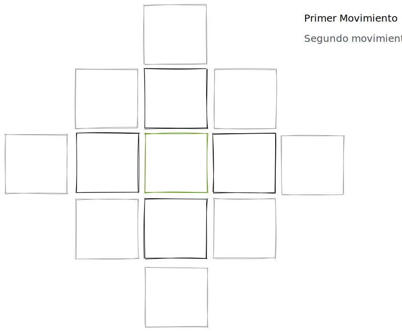
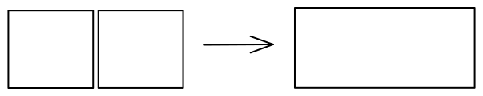

Las piezas son cuadradas. Se hacen à partir de un cuadrado de 8x8 cm y se doblan dos veces de manera que se obtenga un cuadrado de 4x4 cm.

## Movimiento

Las piezas se mueven haciéndolas girar sobre una arista.
Pueden moverse hacia cualquier dirección en la que tengan aristas.
Si la pieza ya se ha levantado, tiene que terminar de girar, aunque después vuelva hacia atrás.

Se puede gastar un movimiento para rotar la pieza si es necesario

---
## Elementos

Cada pieza representa a un maestro de un elemento, y cada uno tiene su habilidad propia. 
Hay 3 elementos: [Fuego](Elementos/Fuego.md), [Planta](Elementos/Planta.md), [Agua](Elementos/Agua.md)

- [ ] Los elementos sirven para el ataque, el fuego quema la planta, la planta seca el agua y el agua extingue el fuego

---
## Niveles

Los maestros empiezan a nivel 1, para subir de nivel, el jugador tiene que pagar gemas:

 -> 4 gemas para revivirlo (si es posible)
 -> 6 gemas para subir a nivel 2
 -> 8 gemas para subir a nivel 3
 

Al subir de nivel, los maestros reciben una montura que les hace mas grandes como se puede ver en la imagen

> Tienes que desdoblar el papel

Al mejorar, son mas grandes por lo que pueden moverse mas con el mismo movimiento

En el nivel 3:

Al nivel 3 son mas grandes pero también mas fuertes, ahora pueden matar al color que los mata

> ej. Si el maestro es de fuego, muere por el agua, pero ahora si el ataca al agua, la marta. Se mantiene que si el agua le ataca, el muere

