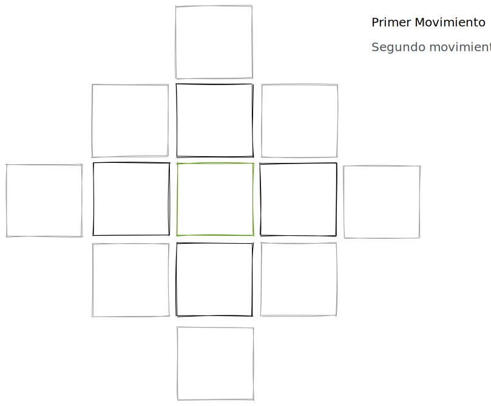
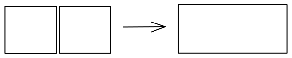
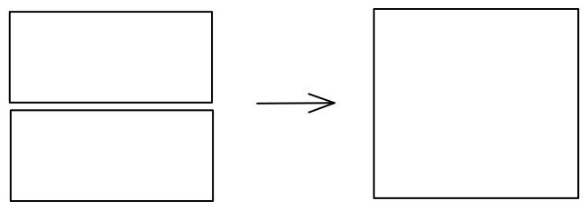

Las piezas son cuadradas (por lo menos en esta primera versión(se está valorando la posibilidad de hexágonos). Se hacen à partir de un cuadrado de 8x8 cm y se doblan dos veces de manera que se obtenga un cuadrado de 4x4 cm.

Cada pieza representa a un maestro de un elemento, y cada uno tiene su habilidad propia. 
Hay 3 elementos: [Fuego](Fuego.md), [Vida](Vida.md), [Agua](Agua.md)

Las piezas se mueven haciéndolas girar sobre una arista.
Pueden moverse hacia cualquier dirección en la que tengan aristas.
Si la pieza ya se ha levantado, tiene que terminar de girar, aunque después vuelva hacia atrás.

Se puede gastar un movimiento para rotar la pieza si es necesario

Los maestros empiezan a nivel 1, para subir de nivel, el jugador tiene que pagar gemas:

 -> 6 gemas para subir a nivel 2
 -> 8 gemas para subir a nivel 3
 -> 4 gemas para revivirlo (si es posible)

Al subir de nivel, los maestros reciben una montura que les hace mas grandes como se puede ver an la imagen

Al mejorar, son mas grandes por lo que pueden moverse mas con el mismo movimiento

En el nivel 3:

Al nivel 3 son mas grandes pero tambien mas fuertes, ahora pueden matar al color que los mata

> ej. Si el maestro es de fuego, muere por el agua, pero ahora si el ataca al agua, la marta. Se mantiene que si el agua le ataca, el muere

